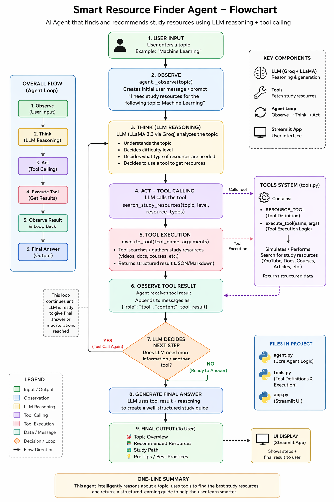

# 🎓 Smart Resource Finder Agent

<div align="center">


**An Agentic AI study assistant that helps college students find curated learning resources and build personalized exam study plans — powered by Groq API and LLaMA 3.3-70B.**

[Features](#-features) • [Demo](#-demo) • [Installation](#-installation) • [Usage](#-usage) • [Architecture](#-architecture) • [Tech Stack](#-tech-stack) • [Contact](#-contact)

</div>

---

## 📌 Overview

**Smart Resource Finder Agent** is an agentic AI system designed to support college students in their academic journey. Unlike a simple chatbot, this system implements a full **Observe → Think → Act** agentic loop where the AI autonomously decides which tools to call, executes them, and generates structured responses.

The platform offers two core features:
- 🔍 **Resource Finder** — Automatically discovers videos, documentation, tutorials, research papers, and practice sets for any academic topic
- 📅 **Study Planner** — Generates a personalized day-by-day study schedule based on exam date, available hours, and topics to cover — with live progress tracking

---

## ✨ Features

### 🔍 Resource Finder
- Enter any academic topic and receive structured, categorized study resources
- AI agent autonomously calls a resource search tool using **tool calling / function calling**
- Resources organized into: Videos, Documentation, Tutorials, Research Papers, and Practice Sets
- Each resource includes name, URL, description, and relevance explanation
- Live **Agent Loop display** showing Observe → Think → Act steps in real time

### 📅 Study Planner
- Set your **exam date** and the system plans backwards from today
- Specify **daily study hours** and **topics to cover**
- AI generates a specific, actionable **day-by-day schedule** (not vague tasks)
- Final day is always auto-set to **Full Revision + Mock Test**
- **Interactive progress tracking** — tick off sessions as you complete them
- Live **progress bar** showing completion percentage
- 🎉 Celebration message when all sessions are completed

### 🎨 Interface
- Clean dark-themed UI with gradient background
- Two-tab layout — Resource Finder and Study Planner
- Fully responsive and professional design
- No HTML/CSS knowledge required — built entirely in Python

---

## 🖥️ Demo

### Resource Finder
```
Input  → "Deep Learning"
Output → Structured resources across 5 categories with real URLs
         + Topic overview + Study path + Pro tips
```

### Study Planner
```
Input  → Exam: 2026-05-10 | Hours/day: 3 | Topics: ML, DL, CNN, NLP
Output → 20-day schedule with specific daily tasks
         + Progress tracking with checkboxes
```

---

## 🚀 Installation

### Prerequisites
- Python 3.9 or higher
- A free Groq API key — get one at [console.groq.com/keys](https://console.groq.com/keys)

### Step 1 — Clone the Repository
```bash
git clone https://github.com/YOUR_USERNAME/smart-resource-finder-agent.git
cd smart-resource-finder-agent
```

### Step 2 — Install Dependencies
```bash
pip install -r requirements.txt
```

### Step 3 — Set Your API Key

**Option A — Environment Variable (Recommended)**
```bash
# macOS / Linux
export GROQ_API_KEY="gsk_your_key_here"

# Windows PowerShell
$env:GROQ_API_KEY="gsk_your_key_here"

# Windows Command Prompt
set GROQ_API_KEY=gsk_your_key_here
```

**Option B — Directly in the App**

Simply paste your API key into the sidebar input field after launching the app. No setup required.

### Step 4 — Run the App
```bash
python -m streamlit run app.py
```

Open your browser at **http://localhost:8501**

---

## 📖 Usage

### Using the Resource Finder

1. Navigate to the **🔍 Resource Finder** tab
2. Type any academic topic in the input box
   - Examples: `Machine Learning`, `Fourier Transform`, `Operating Systems`, `Quantum Computing`
3. Click **"Find Study Resources"**
4. Watch the Agent Loop execute in real time
5. View structured resources organized by type

### Using the Study Planner

1. Navigate to the **📅 Study Planner** tab
2. Select your **Exam Date** using the date picker
3. Set your **Study Hours per Day**
4. Enter your **Topics** (one per line), for example:
   ```
   Machine Learning
   Deep Learning
   Convolutional Neural Networks
   Natural Language Processing
   ```
5. Click **"Generate My Study Plan"**
6. Review your personalized day-by-day schedule
7. **Check off** each session as you complete it
8. Track your progress via the live progress bar

---
## 🔄 Pipeline


## 🏗️ Architecture

### Agent Loop — Observe → Think → Act

```
Student Input (topic)
        │
        ▼
┌───────────────┐
│    OBSERVE    │  ← Parse and wrap the student's topic
└───────┬───────┘
        │
        ▼
┌───────────────┐
│     THINK     │  ← Groq LLM reasons about resource types & difficulty
└───────┬───────┘
        │  tool_call: search_study_resources(topic, level, resource_types)
        ▼
┌───────────────┐
│      ACT      │  ← Execute tool → feed result back → LLM composes answer
└───────┬───────┘
        │
        ▼
Structured Markdown Response → Streamlit UI
```

### Project Structure

```
smart-resource-finder-agent/
│
├── app.py              # Streamlit web interface (two-tab UI)
├── agent.py            # Agentic loop — Observe → Think → Act
├── tools.py            # Tool definition and executor
├── requirements.txt    # Python dependencies
└── README.md           # Project documentation
```

### File Responsibilities

| File | Responsibility |
|------|---------------|
| `app.py` | Web interface, tab layout, user inputs, result rendering, study planner UI |
| `agent.py` | Groq API connection, agentic loop, tool call detection and execution |
| `tools.py` | Tool schema definition, tool executor, parameter routing |

---

## 🛠️ Tech Stack

| Technology | Version | Purpose |
|-----------|---------|---------|
| Python | 3.11 | Core programming language |
| Groq API | Latest | Ultra-fast LLM inference engine |
| LLaMA 3.3-70B | Meta | Large language model for resource generation and planning |
| Streamlit | ≥ 1.35 | Python-based web application framework |
| Groq Python SDK | ≥ 0.9.0 | Official client for Groq API communication |
| Tool Calling | — | Agentic mechanism for autonomous tool invocation |
| JSON | — | Structured data exchange and study plan parsing |
| Custom CSS | — | Dark theme, animations, and UI styling |

---

## 📦 Dependencies

```txt
groq>=0.9.0
streamlit>=1.35.0
```

Install with:
```bash
pip install -r requirements.txt
```

---

## 🔑 Environment Variables

| Variable | Required | Description |
|----------|----------|-------------|
| `GROQ_API_KEY` | Yes | Your Groq API key from console.groq.com |

---

## 🙋 FAQ

**Q: Is the Groq API free?**
Yes. Groq offers a free tier with generous rate limits, sufficient for demos and student projects. Get your key at [console.groq.com/keys](https://console.groq.com/keys).

**Q: Does the study plan persist after closing the browser?**
Currently the plan is stored in Streamlit session state and resets on page refresh. For persistent storage, a database integration can be added in future versions.

**Q: Can I use a different LLM model?**
Yes. In `agent.py`, change the `MODEL` constant to any Groq-supported model such as `mixtral-8x7b-32768` or `gemma2-9b-it`.

**Q: Why does Streamlit rerun on every interaction?**
Streamlit reruns the entire script on each user action by design. Session state is used to preserve the study plan and checkbox values across these reruns.

---

## 🔮 Future Improvements

- [ ] Persistent database storage for study plans (SQLite / Firebase)
- [ ] Export study plan as PDF
- [ ] YouTube API integration for real video search
- [ ] Email reminder system for daily study sessions
- [ ] Multi-subject support with separate progress tracking per subject
- [ ] Dark/Light mode toggle

---

## 📄 License

This project is licensed under the MIT License — see the [LICENSE](LICENSE) file for details.

---

## 👤 Contact

**Your Name**
- 📧 Email: bharathkesav1275@gmail.com
- 🐙 GitHub: [@bk1210](https://github.com/bk1210)
- 🎓 Institution:Amrita Vishwa Vidyapeetham

---

## 🙏 Acknowledgements

- [Groq](https://groq.com) — for providing free, ultra-fast LLM inference
- [Meta AI](https://ai.meta.com/llama/) — for the open-source LLaMA 3.3-70B model
- [Streamlit](https://streamlit.io) — for making Python web apps effortless

---

<div align="center">

**⭐ If you found this project useful, please give it a star on GitHub! ⭐**

*Built with ❤️ for college students everywhere*

</div>
